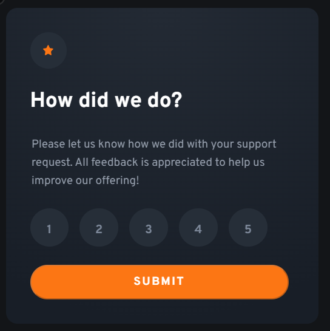
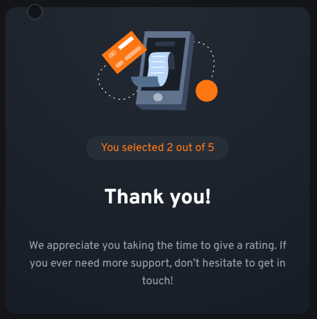

# Frontend Mentor - Interactive rating component solution

This is a solution to the [Interactive rating component challenge on Frontend Mentor](https://www.frontendmentor.io/challenges/interactive-rating-component-koxpeBUmI). Frontend Mentor challenges help you improve your coding skills by building realistic projects.

## Table of contents

- [Overview](#overview)
  - [The challenge](#the-challenge)
  - [Screenshot](#screenshot)
  - [Links](#links)
- [My process](#my-process)
  - [Built with](#built-with)
  - [What I learned](#what-i-learned)
  - [Continued development](#continued-development)
  - [Useful resources](#useful-resources)
- [Author](#author)
- [Acknowledgments](#acknowledgments)

## Overview

### The challenge

Users should be able to:

- View the optimal layout for the app depending on their device's screen size
- See hover states for all interactive elements on the page
- Select and submit a number rating
- See the "Thank you" card state after submitting a rating

### Screenshot

### Links

- Solution URL: [https://github.com/dsoluk/interactive-rating-component-main](https://github.com/dsoluk/interactive-rating-component-main)
- Live Site URL: [https://dsoluk.github.io/interactive-rating-component-main/](https://dsoluk.github.io/interactive-rating-component-main/)

## My process

### Built with

- Semantic HTML5 markup
- Flexbox
- Mobile-first workflow
- js - flip card and button control
- this version used radio buttons and event listeners
- tried to make more responsive to devices widths following comments from @grace-snow

### What I learned

My first attempt at a challenge with JavaScript so lots of learning there.

Despite having done several Newbie challenges I am just starting to feel comfy with centering elements...disappointed that it took this long. Likely more work on this via more work and focus.

Reworked this after feedback from Grace who pointed out that I was supposed to use radio buttons. I also looked HTML naming and structure (too many / unnecessary divs) at her advice and warnings on solution submission. Grace was nice to provide more comments so addressed those mostly. Still need to work on avoiding setting specific width / height.

### Continued development

More JS for sure.

How to use aria in forms...

How to make card sizing more generic (i.e. w/o using width and height)

### Useful resources

- [flip card effect](https://jefferson-cuartas.medium.com/how-to-create-a-flip-card-effect-using-javascript-767dd945210c)

## Author

- Frontend Mentor - [@DSoluk](https://www.frontendmentor.io/profile/DSoluk)

## Acknowledgments

Once again, Morten from LinkedIn Learning. His vids are great! @grace-snow from FrontEnd Mentor too!
